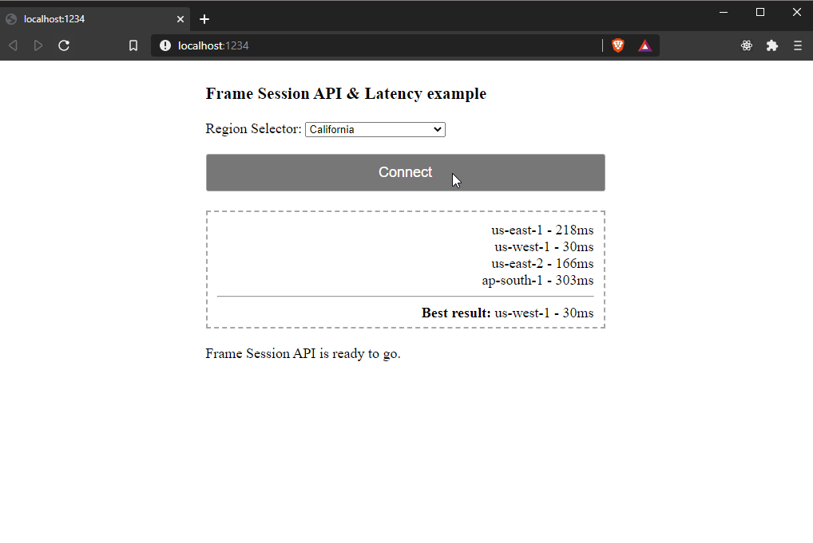

<!-- PROJECT LOGO -->
<br />
<p align="center">

  <h3 align="center">Frame Session API & AWS Latency check example</h3>
  
  <p align="center">
    A simple example that showcases the ability to ping various AWS regions and determine the best Frame account or region to start a Frame session with.
  </p>
</p>

<!-- TABLE OF CONTENTS -->
<details open="open">
  <summary>Table of Contents</summary>
  <ol>
    <li>
      <a href="#about">About</a>
      <ul>
        <li><a href="#built-with">Built With</a></li>
      </ul>
    </li>
    <li>
      <a href="#getting-started">Getting Started</a>
      <ul>
        <li><a href="#prerequisites">Prerequisites</a></li>
        <li><a href="#installation">Installation</a></li>
      </ul>
    </li>
    <li><a href="#usage">Usage</a></li>
    <li><a href="#license">License</a></li>
    <li><a href="#contact">Contact</a></li>
  </ol>
</details>

<!-- ABOUT THE PROJECT -->

## About

### What is this?
On "Classic" Frame, the FrameApp API included a [RegionSelector API](https://developer.fra.me/docs/application-api#regionselector) that made it easy to ping and test various cloud providers and regions for latency and automatically select a region based on the speed-test results. This functionality is not present in the newer Xi Frame platform and this example aims to demonstrate how to do that without this Classic Frame API.

For simplicity, this example does not go into details about authentication and handling of tokens. For more details on that, please [visit the docs](https://docs.frame.nutanix.com/frame-apis/session-api.html#obtain-session-api-authentication-tokens).

### Built With

This example uses the following technologies to showcase this simple web application.

- [Nodejs](https://nodejs.org)
- [yarn](https://classic.yarnpkg.com/en/) or [npm](https://www.npmjs.com/)
- [Parcel](https://parceljs.org/)
- [Frame Session API](https://docs.frame.nutanix.com/frame-apis/session-api.html)

### How does the latency test work?

Exactly like [cloudping.info](https://www.cloudping.info/) -- we send a single request to each AWS region and measure the time it takes to get a response. 

<!-- GETTING STARTED -->

## Getting Started

### Prerequisites

- A recent Nodejs version installed (to power the tools & web server)
- `npm` or `yarn` (to install and run the npm packages)
- `git` to clone this repo.
- AWS-based Frame accounts with at least one published instance on each account.

### Installation

1. Clone the repo
   ```sh
   git clone https://github.com/saucesome/SessionApiAwsLatencyExample.git
   ```
2. Install NPM packages from within the cloned repo directory:
   ```sh
   cd /path/to/cloned/repo/
   
   yarn install
   ```
    (or `npm install`)

3. Gather the names of the AWS region's you'd like to measure latency for. AWS lists them [here](https://docs.aws.amazon.com/AWSEC2/latest/UserGuide/using-regions-availability-zones.html#concepts-regions).
4. [Gather your Frame account details](https://docs.frame.nutanix.com/frame-apis/session-api.html#required-session-api-components) for each region/account you'd like to serve. We need the `terminalConfigId` for each account you'd like to use with the Session API.
5. Enter your regions and account details into `config.js`. For example:
   ```JS
   export const AwsRegionNames = {
     VIRGINIA: "us-east-1",
     CALIFORNIA: "us-west-1",
   };

   export const FrameAccountConfigs = {
     VIRGINIA: {
       terminalConfigId: "paste-your-terminal-config-id-here",
       // applicationId: "",
     },
     CALIFORNIA: {
       terminalConfigId: "paste-your-terminal-config-id-here",
       // applicationId: "",
     },
   }
   ```
6. Get a valid user token. You can retrieve a token from:
   1. Secure Anonymous Token Provider (recommend 1hr or more token durations for testing):
      - Dashboard/SAT Provider/Playground
      - [Secure Anonymous Token API call](https://docs.frame.nutanix.com/frame-apis/sat-api.html#generating-secure-anonymous-tokens)
   2. Copy your token from the advanced section of your [Frame user profile Profile page](https://console.nutanix.com/profile/advanced). You'll have to copy and update this if it expires though.
7. Paste your token into `config.js` for the value of `devToken`.
   ```sh
   export const devToken = "paste-your-jwt-here-between-quotes";
   ```
   This will need to be updated each time your token expires.

<!-- USAGE EXAMPLES -->

## Running the dev server

1. Start the server with `yarn start` or `npm run start`.
2. Open your browser to [`http://localhost:1234`](http://localhost:1234)

_For building the app for production deployments, please read [Parcel's documentation](https://parceljs.org/cli.html#build)._

<!-- LICENSE -->

## License

Distributed under the MIT License. See `LICENSE` for more information.

<!-- CONTACT -->

## Contact

Jason Thompson - jason.thompson@nutanix.com

Project Link: [https://github.com/saucesome/SessionApiAwsLatencyExample](https://github.com/saucesome/SessionApiAwsLatencyExample)
